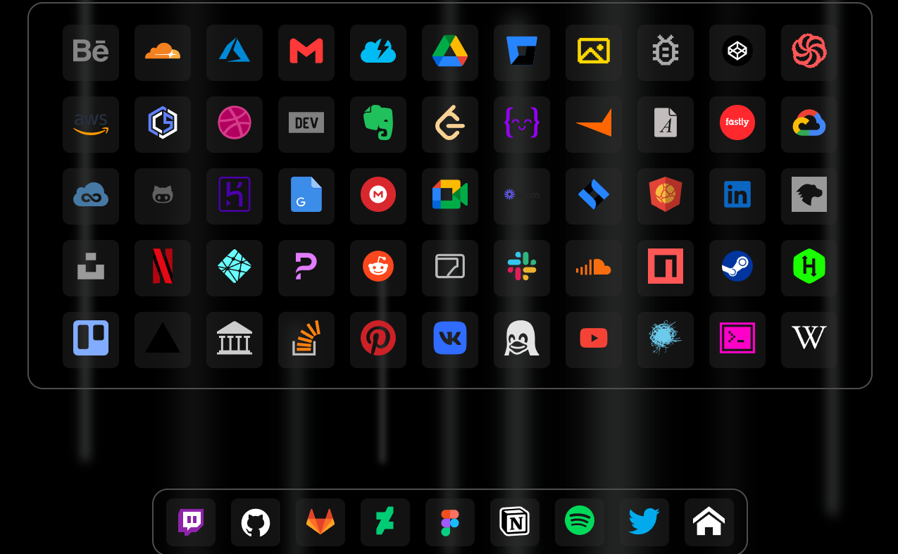

## Modern [start-page](fxhxyz4.github.io/startpage).

###   

### 

#

### run localy

```
git clone https://github.com/fxhxyz4/startpage.git
cd startpage
code .
```

#

### install packages

```
npm install
```

#

### development

```
npm run dev
```

### open [localhost:1324](http://localhost:1324)

#

### production

```
npm run build
```

#

### background animation: [codepen url](https://codepen.io/alvarotrigo/pen/ZEJqBdY)

#

### questions?

- write in [issues](https://github.com/fxhxyz4/startpage/issues) or [discussions](https://github.com/fxhxyz4/startpage/discussions)

#

### License: [GPL-3.0](./LICENSE.md)
